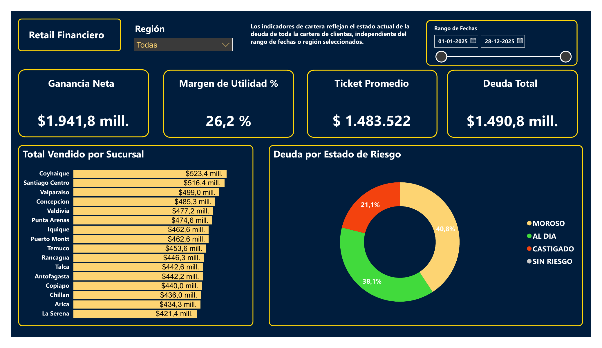
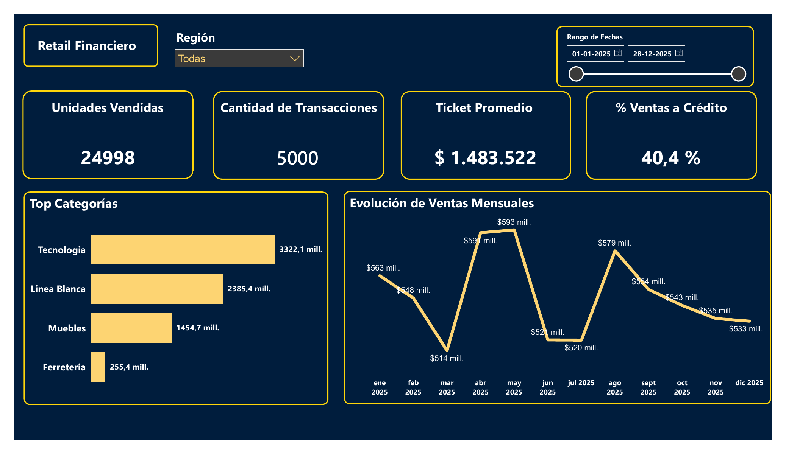
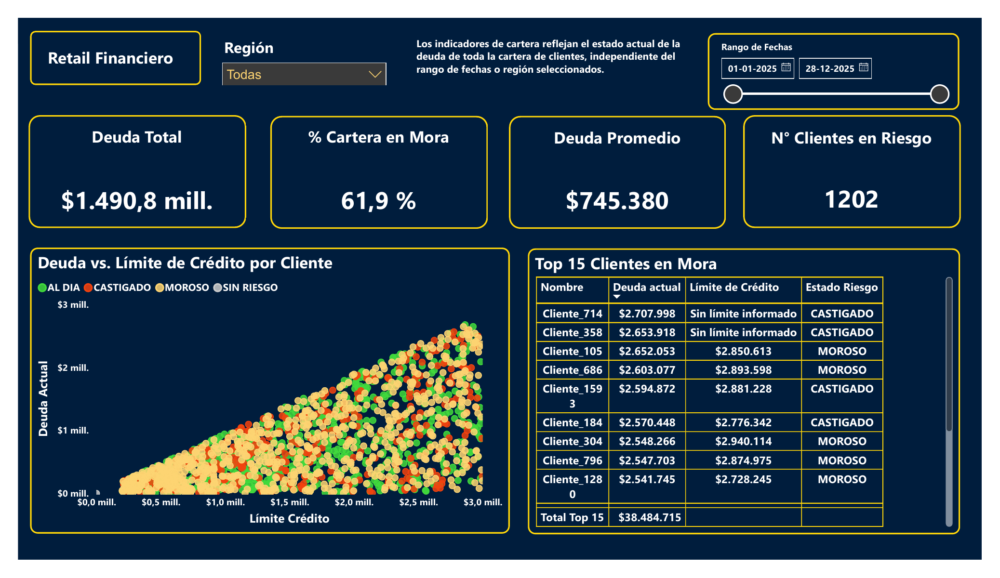

# Retail Financiero: análisis de ventas, riesgo crediticio e inventario

> Pipeline completo Python → MySQL → Power BI sobre un retail financiero chileno simulado de 16 locales: 5.000 transacciones, 2.000 clientes con línea de crédito y 1.600 registros de inventario.

**Insight principal:** el **11,05% de la facturación ($819.575.324 de $7.417.609.719)** corresponde a ventas **sin cliente identificable**. Si no se aísla, ese registro técnico encabeza el ranking de clientes con **44,9 veces** el gasto del primer cliente real y deforma toda la segmentación de cartera. Detectarlo, aislarlo y declararlo es el resultado central de este proyecto.

📄 **[Ver el dashboard completo en PDF](dashboard/dashboard_retail_financiero.pdf)** — se abre en el navegador, sin instalar Power BI ni descargar nada.


*Página 1 — Visión General: Ganancia Neta, margen, ticket promedio y deuda total, con la venta por sucursal y la composición de la deuda por estado de riesgo.*


*Página 2 — Detalle de Ventas: unidades, transacciones, % de venta a crédito y la evolución mensual sobre las 4.450 transacciones con fecha parseable.*


*Página 3 — Cartera y Riesgo: los 1.202 clientes en mora, la relación deuda/límite y el Top 15 por deuda. Los clientes sin límite informado se muestran como tales, no como límite cero.*

---

## Problema de negocio

Un retail financiero vende con tarjeta propia: la misma empresa factura y presta. Eso obliga a mirar tres cosas a la vez y no por separado:

1. **Comercial** — qué locales y qué categorías sostienen la venta.
2. **Riesgo** — cuánta deuda hay en clientes morosos y castigados, y cuánto de su línea están usando.
3. **Inventario** — qué productos están por quebrar stock y cuánto capital hay inmovilizado.

El proyecto responde esas preguntas y, antes de responderlas, mide cuánto de los datos es utilizable.

## Datos y alcance

| | |
|---|---|
| **Origen** | Dataset sintético generado con Python (`scripts/00_data_generator.py`) |
| **Período** | Año 2025 completo, frecuencia diaria |
| **Universo** | 16 locales · 2.000 clientes · 100 productos · 5.000 transacciones · 12.520 líneas de detalle |
| **Facturación total** | $7.417.609.719 (ticket promedio $1.483.522) |
| **Deuda total de cartera** | $1.490.759.149 |
| **Motor** | MySQL 8 / MariaDB 10.11 (verificado en ambos) |

**Por qué datos sintéticos:** no existe una fuente pública que entregue, al mismo tiempo, el detalle transaccional, el estado crediticio por cliente y el stock por local que este análisis necesita. Los datos se generaron **sucios a propósito** para que la limpieza fuera un ejercicio real:

| Defecto inyectado | Volumen medido |
|---|---|
| Ventas sin cliente (id huérfano 9999) | 532 transacciones (10,64%) · $819.575.324 (11,05%) |
| Fechas en 4 formatos distintos | 3.492 ISO · 476 DD/MM/AAAA · 482 DD-MM-AAAA · 550 en texto |
| Clientes sin límite de crédito informado | 119 (5,95%) |
| Inconsistencias de texto (`' al dia '`, `'MOROSO '`, `' debito '`) | En `estado_riesgo` y `tipo_pago` |

Las limitaciones de este dataset están declaradas al final del README, y una de ellas cambia lo que se puede concluir.

## Stack y arquitectura

```
data/*.csv                 →  MySQL (capa bronce)   →  Vistas (capa plata)   →  Power BI
6 tablas relacionadas         tablas crudas sin        vw_transacciones_limpias   dashboard
generadas con Python          modificar                vw_clientes_credito_limpios  3 páginas
                                                             ↓
                                              scripts/04_verificacion_kpis.py
                                              recalcula cada cifra desde los CSV
```

**Modelo relacional:** 6 tablas con claves foráneas declaradas —`locales`, `clientes_credito` y `productos` como dimensiones; `inventario`, `transacciones` y `detalle_transacciones` como hechos.

**Por qué vistas y no `UPDATE`:** las tablas crudas nunca se modifican. Toda la limpieza vive en dos vistas, así el dato original siempre está disponible para auditar y la limpieza se puede corregir sin volver a cargar nada.

## Hallazgos

Cada cifra indica la base sobre la que se calculó. Todas se reproducen con `python scripts/04_verificacion_kpis.py`.

**1. El 11,05% de la venta no tiene cliente identificable — y sin aislarlo, arruina el análisis de cartera.**
532 de 5.000 transacciones ($819.575.324) entran con el id técnico 9999, que existe para no romper la integridad referencial. Como no estaba excluido de los rankings, encabezaba el Top 10 de clientes con **44,9 veces** el gasto del primer cliente real ($819.575.324 vs. $18.268.576). *Consecuencia:* toda campaña de fidelización construida sobre ese ranking apuntaba a un cliente que no existe.

**2. El 61,9% de la deuda está en clientes que ya dejaron de pagar bien.**
De los $1.490.759.149 de deuda (base: 2.000 clientes), $922.417.161 corresponde a clientes MOROSO ($607.771.351) o CASTIGADO ($314.645.810). *Consecuencia:* la cobranza tiene un universo acotado y priorizable, no una cartera difusa.

**3. La utilización de crédito sube junto con el riesgo.**
Base: 1.881 clientes con límite informado. CASTIGADO usa el **49,2%** de su línea, MOROSO el **47,7%** y AL DÍA el **46,4%**. La brecha es de 2,8 puntos porcentuales. *Consecuencia:* la utilización sirve como señal temprana, pero débil; por sí sola no separa buenos de malos pagadores.

**4. Tecnología concentra el 44,8% de la venta y lidera en los 16 locales.**
$3.322.053.298 de $7.417.609.719, con 9.569 unidades (base: las 12.520 líneas de detalle). No hay ningún local donde otra categoría desplace a tecnología. *Consecuencia:* el quiebre de stock en tecnología no es un problema local, es un problema de red.

**5. No existe Pareto en esta cartera — y eso es un límite del dato, no un hallazgo comercial.**
Se necesitan **948 de 1.749 clientes (54,2%)** para acumular el 80% de la venta. Un 80/20 real estaría cerca del 20%. *Consecuencia:* el generador reparte el gasto de forma uniforme, así que este dataset **no sirve** para concluir sobre concentración de clientes. Se deja el KPI publicado justamente para dejarlo dicho.

**6. La segmentación anterior no segmentaba.**
Con umbrales fijos de $900.000 y $500.000 sobre gasto acumulado —cuando el ticket promedio ya es $1.483.522— el **89,7%** de la cartera quedaba como "VIP". Reemplazados por terciles: el tercio alto (583 clientes) genera el **59,7%** de los ingresos y el tercio bajo el **11,3%**. *Consecuencia:* ahora los tramos discriminan y se pueden accionar por separado.

## Cómo reproducirlo

**Requisitos:** Python 3.10+, MySQL 8 o MariaDB 10.11+ (XAMPP sirve), Power BI Desktop.

```bash
git clone https://github.com/maximunozf/portfolio-retail-financiero.git
cd portfolio-retail-financiero
pip install -r requirements.txt
```

1. **Los datos ya están en `data/`.** No hace falta generarlos. Si quieres regenerarlos desde cero:
   `python scripts/00_data_generator.py --force` (ver la nota sobre reproducibilidad más abajo).

2. **Levantar la base completa en un comando:**
   ```bash
   python scripts/05_cargar_mysql.py --password TU_CLAVE
   ```
   Crea la base, las 6 tablas con sus claves foráneas, carga los 21.236 registros en el orden que exigen las FK y crea las vistas de limpieza. Al terminar imprime un control de integridad: debe decir 5.000 transacciones y $7.417.609.719.

   *Alternativa manual (phpMyAdmin / Workbench):* ejecutar `sql/01_setup_database.sql`, importar los 6 CSV en el orden `locales → clientes_credito → productos → inventario → transacciones → detalle_transacciones` siguiendo las instrucciones comentadas al final de ese script, y después ejecutar `sql/02_data_wrangling.sql`.

3. **Correr los KPIs:** ejecutar `sql/03_business_analytics.sql`.

4. **Verificar las cifras sin MySQL:** `python scripts/04_verificacion_kpis.py`. Recalcula desde los CSV cada número publicado en este README, por una vía independiente del motor de base de datos.

## Decisiones técnicas

**El cliente anónimo se excluye de los análisis, no se borra.**
Insertar el id 9999 (metodología Kimball) es correcto: evita que 532 ventas queden huérfanas y rompan la clave foránea. El error estaba en arrastrarlo a los rankings de cartera. Ahora los KPI de cliente lo filtran explícitamente y su peso se reporta como indicador de calidad de datos.

**El límite de crédito ausente queda en `NULL`, no en `0.00`.**
Convertir 119 límites vacíos a cero los dejaba en el denominador de la tasa de utilización con línea 0 y deuda positiva, lo que sobrestimaba la utilización en unos 3 puntos porcentuales (CASTIGADO marcaba 52,3% en vez de 49,2%). "No sabemos su límite" no es lo mismo que "su límite es cero".

**La segmentación usa cuantiles, no umbrales en pesos.**
Un umbral elegido a ojo deja de servir apenas cambia el ticket promedio. `NTILE(3)` deja que el corte lo fije la distribución real de la cartera. Si el negocio prefiere umbrales en pesos, se fijan mirando los cortes que entrega esta consulta.

**El mes en texto se parsea con un mapeo explícito, no con `STR_TO_DATE(..., '%d %M %y')`.**
`%M` depende de la variable de sesión `lc_time_names`, que en MySQL viene en inglés por defecto: la misma consulta daría resultados distintos en dos servidores. El mapeo explícito funciona en cualquier instalación.

**El KPI mensual declara su base y excluye 550 transacciones.**
En el dataset versionado, todas las fechas en formato texto salieron con un literal fijo del generador, así que caen el mismo día. Incorporarlas triplicaría mayo e inventaría un peak que no existe. Se excluyen (base: 4.450 transacciones, 89,0%, $6.591.728.756) y se dice. El generador ya está corregido para datasets nuevos.

**Markup y margen son dos columnas distintas.**
`(precio - costo) / costo` es markup; `(precio - costo) / precio` es margen. Antes la primera fórmula se publicaba con el nombre de la segunda. Ahora van las dos, rotuladas.

## Limitaciones

- **Los datos son sintéticos.** Sirven para demostrar el pipeline y las decisiones de limpieza, no para concluir sobre el mercado chileno. El hallazgo 5 es el ejemplo concreto de dónde eso se nota.
- **Reproducibilidad parcial.** Los CSV versionados en `data/` son el dataset canónico: sobre ellos se calculó cada cifra de este README. Se generaron **antes** de fijar la semilla aleatoria, por lo que volver a correr el generador produce un dataset equivalente en estructura pero no idéntico en valores. De ahí en adelante, con `SEMILLA = 42`, cualquier ejecución es reproducible.
- **Un solo año (2025) y una sola foto de la cartera.** Los indicadores de deuda son un corte, no una serie: no se puede medir evolución de la morosidad en el tiempo.
- **16 locales de una cadena simulada**, no el retail financiero chileno.
- El proyecto trabaja con datos reales de la CMF en su continuación: [analisis-riesgo-bancario-chile](https://github.com/maximunozf/analisis-riesgo-bancario-chile).

## Estructura del repositorio

```
├── data/            CSV del dataset canónico (no modificar)
├── scripts/
│   ├── 00_data_generator.py      generación del dataset sintético
│   ├── 04_verificacion_kpis.py   recálculo independiente de todas las cifras
│   └── 05_cargar_mysql.py        reconstrucción de la base en un comando
├── sql/
│   ├── 01_setup_database.sql     modelo relacional + instrucciones de carga
│   ├── 02_data_wrangling.sql     perfilamiento + vistas de limpieza
│   └── 03_business_analytics.sql 16 consultas de KPI, cada una con su base
├── dashboard/
│   ├── retail_financiero_dashboard.pbix   informe de Power BI
│   └── dashboard_retail_financiero.pdf    export para revisarlo sin Power BI
└── docs/
    ├── dashboard.md              modelo, páginas y limitaciones del informe
    └── dashboard_0*.png          capturas de las 3 páginas (exportadas del .pbix)
```

---

**Autor:** Maximiliano Muñoz Fuentes — Analista Programador, en formación como Analista de Datos.
[GitHub](https://github.com/maximunozf) · [Portafolio](https://atlantic-message-83c.notion.site/Maximiliano-Mu-oz-39df3c321fea807888aefa80ece9e316)
